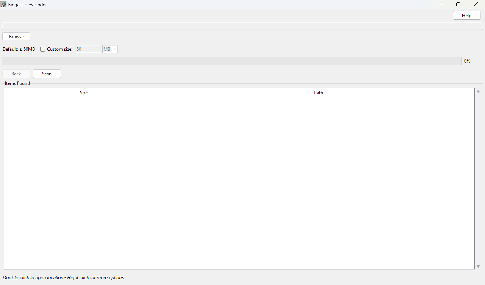

# File Size Explorer

A Python GUI application that helps you find and navigate the largest files and folders in your system.




## Features

- **Size Analysis**: Quickly identify the largest files and folders in any directory
- **Interactive Navigation**: 
  - Double-click folders to explore their contents
  - Use the "Back" button to return to parent directories
- **User-Friendly Interface**:
  - Clear size display in appropriate units (bytes, KB, MB, GB)
  - Tooltips showing full file/folder paths on hover
  - Status updates displayed at the bottom of the window
- **Convenient Actions**:
  - Copy file/folder names with a single click
  - Open file locations directly in Windows Explorer
  - Sort results by size or name

## Requirements

- Python 3.x
- tkinter (usually comes with Python installation)

## Installation

1. Clone or download this repository
2. Ensure Python 3.x is installed on your system
3. No additional package installation is required as the application uses standard Python libraries

## Usage

1. Run the application:
   ```
   python find_biggest.py
   ```

2. Click "Browse" to select a starting directory
3. Click "Find Biggest" to analyze the selected directory
4. Results will be displayed in a tree view:
   - Double-click folders to navigate into them
   - Click the "Back" button to return to the parent directory
   - Hover over paths to see the full location
   - Click on items to copy their names or open their locations

## Tips

- The application window is sized at 700x400 pixels for optimal viewing
- Status messages at the bottom provide feedback on your actions
- Use the column headers to sort items by different criteria
- The tree view shows both files and folders, sorted by size by default

## Contributing

Feel free to submit issues and enhancement requests!

